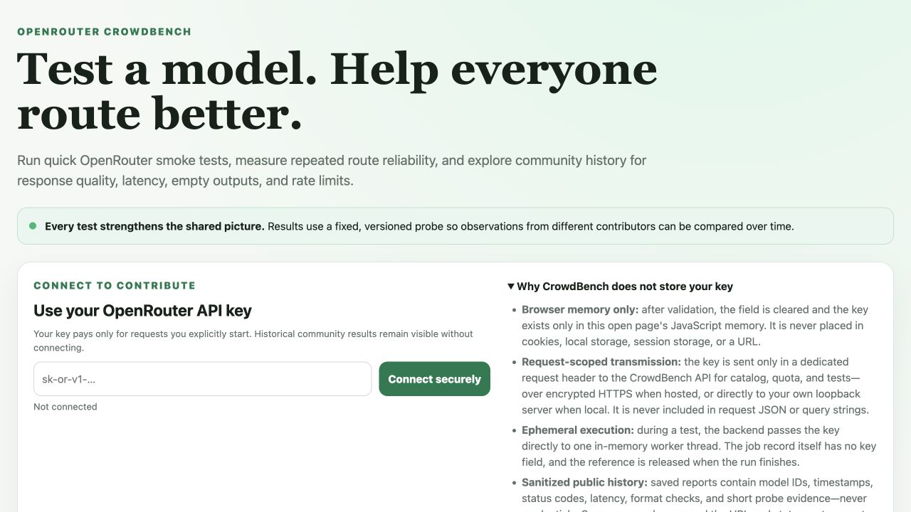
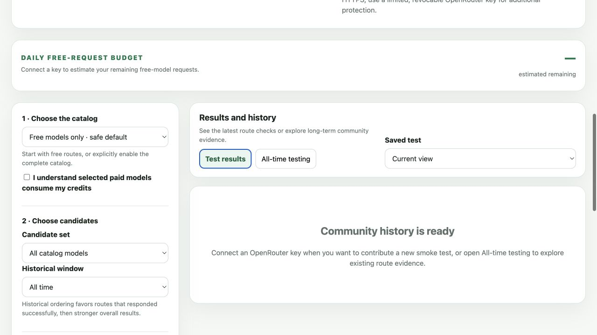
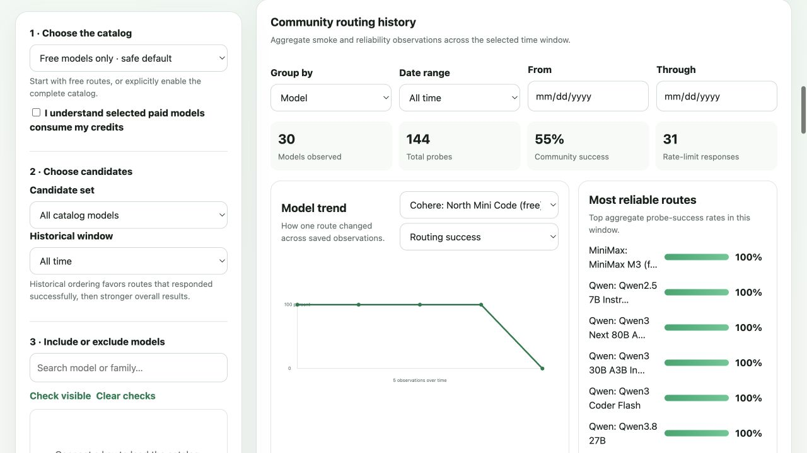

# OpenRouter CrowdBench

OpenRouter CrowdBench is an independent, community-oriented tool for checking which
OpenRouter model routes respond now—and how reliability, latency, instruction
compliance, empty-output rates, and HTTP 429 rates change over time.

**Principal developer:** Mark Austin

**License:** [MIT](LICENSE)

**Status:** Early public preview; contributions and reproducible observations are welcome.

OpenRouter CrowdBench is not affiliated with or endorsed by OpenRouter.

## What it looks like

### Connect without storing your key



### Smoke-test the current model catalog



### Explore historical routing quality



## Run it locally

Requirements: Python 3.11 or newer and an OpenRouter API key. The runtime uses only
the Python standard library; `pytest` is needed only for tests.

```bash
git clone https://github.com/maustin10/openrouter-crowdbench.git
cd openrouter-crowdbench
python3 audition.py --port 8012
```

Open <http://127.0.0.1:8012>, paste your OpenRouter key into the connection card,
and choose **Connect securely**. No server-level OpenRouter key is required or read
from `.env`.

To expose the service to other devices on a trusted network:

```bash
python3 audition.py --host 0.0.0.0 --port 8012
```

Do not expose plain HTTP to the public internet. A public deployment must terminate
HTTPS before requests reach CrowdBench.

## Typical workflow

1. Connect a contributor key.
2. Keep **Free models only** selected unless you intentionally want paid routes.
3. Run one fixed smoke probe across all, historically successful, explicitly
   included, or explicitly excluded models.
4. Select the routes that responded and run repeated reliability probes.
5. Use **All-time testing** to compare success, overall score, latency, and 429 rate
   across a selected date window.

The smoke probe is fixed and versioned. A successful response must return expected
visible tokens, which makes observations from different contributors and times more
comparable.

## Contributor-key security

- The key is retained only in the current page's JavaScript memory.
- It is never written to cookies, local storage, session storage, a URL, or request JSON.
- Authenticated calls carry it in the `X-OpenRouter-Key` request header, over HTTPS
  when hosted or directly to the loopback server when running locally.
- The backend passes it directly to the active in-memory worker thread. The key is
  not a property of the job and is released when the worker finishes.
- Jobs, saved reports, the usage ledger, and public history contain no key field.
- The built-in HTTP access log records request paths and status codes, not headers.
- Disconnecting or closing the page removes the browser copy.

For a public deployment, contributors should use a limited, revocable OpenRouter key.
OAuth with PKCE and short-lived keys is the recommended future authentication path.

## Deploy on Render

This repository includes a Render Blueprint in [`render.yaml`](render.yaml). It uses
a paid `0.5c-512mb` web service with a 1 GB persistent disk because Render's free web
service filesystem is ephemeral. The disk preserves the shared JSON report archive
and usage ledger under `/var/data` across restarts and deploys.

1. Fork or connect this repository to Render.
2. In Render, choose **New → Blueprint** and select the repository.
3. Review the proposed `openrouter-crowdbench` service and apply the Blueprint.
4. After deployment, open `/healthz` and confirm it returns `{"status":"ok", ...}`.
5. Use the generated HTTPS `onrender.com` URL. Do not configure an OpenRouter API key
   as a Render secret; each contributor supplies a request-scoped key in the browser.

For a high-traffic deployment, move report storage from a single persistent disk to
PostgreSQL or an event store. A disk-backed service cannot horizontally scale on
Render, and the current process intentionally permits only one active test at a time.

## Persistence

By default, reports are written to `results/` and request counts to
`usage-ledger.jsonl`. Set `CROWDBENCH_DATA_DIR` to place both under another directory:

```bash
CROWDBENCH_DATA_DIR=/var/data python3 audition.py --host 0.0.0.0 --port 8012
```

These runtime files are excluded from git. Saved reports contain sanitized model and
probe measurements, not contributor credentials.

## Test it

```bash
python3 -m pip install pytest
python3 -m pytest test_audition.py -q
python3 -m py_compile audition.py
```

The health endpoint can be checked while the service is running:

```bash
curl http://127.0.0.1:8012/healthz
```

## Contributing

Issues and pull requests are welcome. Please keep probes deterministic, avoid adding
credentials or private prompts to fixtures, update tests for behavior changes, and
describe how a metric remains comparable across contributors.

## License

Released under the [MIT License](LICENSE). Mark Austin is the principal developer.
